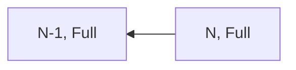
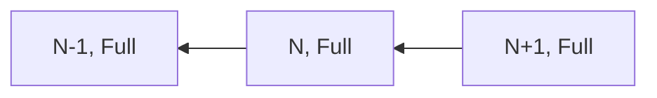
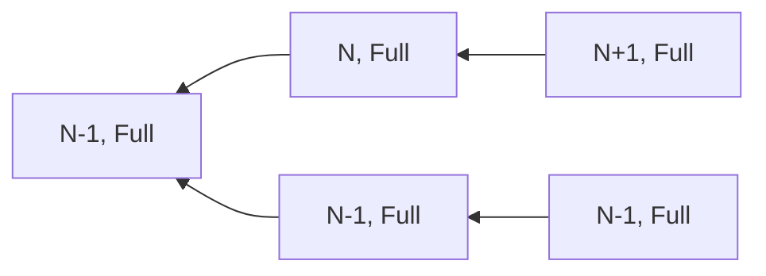
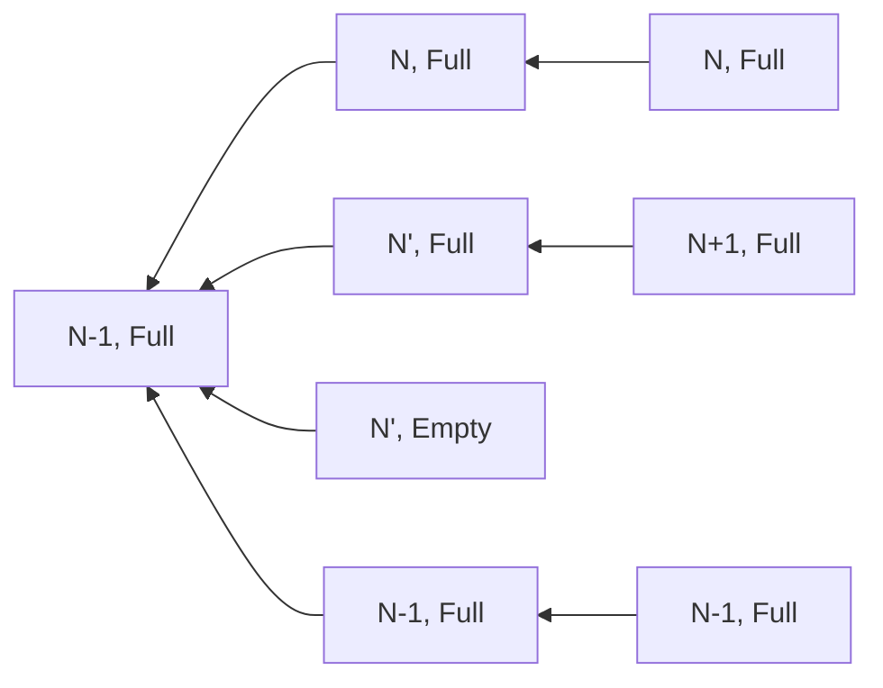

<!-- START doctoc generated TOC please keep comment here to allow auto update -->
<!-- DON'T EDIT THIS SECTION, INSTEAD RE-RUN doctoc TO UPDATE -->
**Table of Contents**  *generated with [DocToc](https://github.com/thlorenz/doctoc)*

- [ePBS design notes](#epbs-design-notes)
  - [Inclusion lists](#inclusion-lists)
    - [Liveness](#liveness)
    - [Censoring](#censoring)
  - [Builders](#builders)
  - [Builder Payments](#builder-payments)
  - [Withdrawals](#withdrawals)
  - [Blobs](#blobs)
  - [PTC Rewards](#ptc-rewards)
  - [PTC Attestations](#ptc-attestations)
  - [Forkchoice changes](#forkchoice-changes)
    - [Checkpoint states](#checkpoint-states)
    - [Block slot](#block-slot)
  - [Equivocations](#equivocations)
  - [Increased Max EB](#increased-max-eb)
  - [Validator transfers](#validator-transfers)

<!-- END doctoc generated TOC please keep comment here to allow auto update -->

# ePBS design notes

## Inclusion lists

ePBS introduces forward inclusion lists for proposers to guarantee censor resistanship of the network. We follow the design described in [this post](https://ethresear.ch/t/no-free-lunch-a-new-inclusion-list-design/16389).

- Proposer for slot N submits a signed block and in parallel broadcasts pairs of `summaries` and `transactions` to be included at the beginning of slot N+1. `transactions` are just list of transactions that this proposer wants included at the most at the beginning of N+1. `Summaries` are lists consisting on addresses sending those transactions and their gas limits. The summaries are signed, the transactions aren't. An honest proposer is allowed to send many of these pairs that aren't committed to its beacon block so no double proposing slashing is involved.
- Validators for slot N will consider the block for validation only if they have seen at least one pair (summary, transactions). They will consider the block invalid if those transactions are not executable at the start of slot N and if they don't have at least 12.5% higher `maxFeePerGas` than the current slot's `maxFeePerGas`. 
- The builder for slot N reveals its payload together with a signed summary of the proposer of slot N-1. Along the summary, the builder includes a list of transactions indices (in strictly increasing order) of the previous payload of slot N-1, that satisfy some entry in the signed inclusion list summary. The payload is considered only valid if the following applies
    - For each index `i` in the payload's `inclusion_list_exclusions`, check that the ith transaction `tx[i]` of the payload for `N-1` satisfies some transaction `T[i]` of the current inclusion list. Here `T[i]` is the first entry in the payload's inclusion list that is satisfied by `tx[i]`. This `T[i]` is removed from the inclusion list summary. 
    - The remaining transactions in the inclusion list summary, are all satisfied by the first transactions in the current payload, in increasing order, starting from the first transaction. 
    - The payload is executable, that is, it's valid from the execution layer perspective. 

**Note:** in the event that the payload for the canonical block in slot N is not revealed, then the summaries and transactions list for slot N-1 remains valid, the honest proposer for slot N+1 is not allowed to submit a new IL and any such message will be ignored. The builder for N+1 still has to satisfy the summary of N-1. If there are k slots in a row that are missing payloads, the next full slot will still need to satisfy the inclusion list for N-1. 

### Liveness

In the usual case of LMD+Ghost we have a proof of the *plausible liveness* theorem, that is that supermajority links can always be added to produce new finalized checkpoints provided there exist children extending the finalized chain. Here we prove that the next builder can always produce a valid payload, in particular, a payload that can satisfy the pending inclusion list. 

Let N be the last slot which contained a full execution payload, and let $N+1,..., N+k$, $k \geq 1$ be slots in the canonical chain, descending from $N$ that were either skipped or are *empty*, that is, the corresponding execution payload has not been revealed or hasn't been included. The consensus block for $N+k$ has been proposed and it is the canonical head. The builder for $N+k$ has to fulfill the inclusion list proposed by $N$. When importing the block $N$, validators have attested for availability of at least one valid inclusion list. That is, those transactions would be executable on top of the head block at the time. Let $P$ be the execution payload included by the builder of $N$, this is the current head payload. Transactions in the attested inclusion list can *only* be invalid in a child of $P$ if there are transactions in $P$ that have the same source address and gas usage that was below the gas limit in the summary. For any such transaction the builder can add such transaction to the exclusion list and not include it in its payload. If there are remaining transactions in its payload from the same address, the nonce will have to be higher nonce than the transaction that was added in the exclusion list. This process can be repeated until there are no more transactions in the summary from that given address that have been invalidated. 

### Censoring

We prove the following: the builder cannot force a transaction in the inclusion list to revert due to gas limit usage. A malicious builder that attempts to add in the exclusion list some transactions from an address with high gas limit but low usage, so that the remaining transactions in the summary have lower gas limit and the included transaction with higher gas usage reverts. However, this is impossible since any transaction in the exclusion list has to have lower nonce since it was already included in the previous block. That is, any attempt by the builder of changing the order in which to include transactions in the exclusion list, will result in its payload being invalid, and thus the inclusion lists transactions that haven't been invalidated on N will remain valid for the next block. 

## Builders

There is a new entity `Builder` that is a glorified validator (they are simply validators with a different withdrawal prefix `0x0b`) required to have a higher stake and required to sign when producing execution payloads. 

- Builders are also validators (otherwise their staked capital depreciates).
- There is nothing to be done to onboard builders as we can simply accept validators with the right `0x0b` withdrawal prefix before the fork. They will be builders automatically. We could however onboard builders by simply turning validators into builders if they achieve the necessary minimum balance and change their withdrawal prefix to be distinguished from normal validators at the fork. 
- We need to include several changes from the [MaxEB PR](https://github.com/michaelneuder/consensus-specs/pull/3) in order to account with builders having an increased balance that would otherwise depreciate. 

## Builder Payments

Payments are processed unconditionally when processing the signed execution payload header. There are cases to study for possible same-slot unbundling even by an equivocation. Same slot unbundling can happen if the proposer equivocates, and propagates his equivocation after seeing the reveal of the builder which happens at 8 seconds. The next proposer has to build on full which can only happen by being dishonest. Honest validators will vote for the previous block not letting the attack succeed. The honest builder does not lose his bid as the block is reorged. 
 
## Withdrawals

Withdrawals are deterministic on the beacon state, so on a consensus layer block processing, they are immediately processed, then later when the payload appears we verify that the withdrawals in the payload agree with the already fulfilled withdrawals in the CL.  

So when importing the CL block for slot N, we process the expected withdrawals at that slot. We save the list of paid withdrawals to the beacon state. When the payload for slot N appears, we check that the withdrawals correspond to the saved withdrawals. If the payload does not appear, the saved withdrawals remain, so any future payload has to include those.

## Blobs

- KZG Commitments are now sent on the Execution Payload envelope broadcasted by the EL and the EL block can only be valid if the data is available. 
- Blobs themselves may be broadcasted by the builder below as soon as it sees the beacon block if he sees it's safe. 

## PTC Rewards
- PTC members are obtained as the first members from each beacon slot committee that are not builders.
- attesters are rewarded as a full attestation when they get the right payload presence: that is, if they vote for full (resp. empty) and the payload is included (resp. not included) then they get their participation bits (target, source and head timely) set. Otherwise they get a penalty as a missed attestation. 
- Attestations to the CL block from these members are just ignored. 
- The proposer for slot N+1 must include PTC attestations for slot N. There is no rewards (and therefore no incentive) for the proposer to include attestations that voted incorrectly, perhaps we can simply accept 1 PTC attestation per block instead of the current two. 

## PTC Attestations

There are two ways to import PTC attestations. CL blocks contain aggregates, called `PayloadAttestation` in the spec. And committee members broadcast unaggregated `PayloadAttestationMessage`s. The latter are only imported over the wire for the current slot, and the former are only imported on blocks for the previous slot. 

## Forkchoice changes

There are significant design decisions to make due to the fact that a slot can have 3 different statuses:

1. The CL block is not included (therefore no payload can be included). This is a *skipped* slot. 
2. The CL block is included and the payload is not revealed. This is an *empty* slot. 
3. The CL block and the payload are both included. This is a *full* slot. 

Consider the following fork

In this fork the proposer of `N+1` is attempting to reorg the payload of `N` that was seen by the majority of the PTC. Suppose that honest validators see that the PTC has voted `N` to be full. Then because of proposer boost, the CL block of `N+1` will have 40% of the committee to start with. Assuming perfect participation, honest validators should see a weight of `100` for `(N, Full)` and a weight of `40` for `N+1` (notice that they attest before seeing the payload). They should choose to vote for `(N, Full)` instead of `N+1`. The question is how do we account for all of this? A few initial comments are in line
- CL attestation do not mention full or empty they simply have a beacon block root. Honest validators will have already set their PTC vote during `N` that `N` was full. 
- The only changes to the view of `N` as empty/full could come only when importing `N+1`, a beacon block that contains PTC Messages attesting for the payload of `N`. However, if honest validators have already achieved the threshold for `full`, they will consider the block full. 
- This is one design decision: instead of having a hard threshold on the PTC (50% in the current spec) we could have a relative one, say for example a simple majority of the counted votes. This has some minor engineering problems (like keeping track of who voted in forkchoice more than simply if they voted for present or not), but this can easily be changed if there are some liveness concerns. 
- The honest builder for `N+1` would not submit a bid here, since honest builders would have seen `N` as full also, they would only build on top of the blockhash included in `N`. 
- The honest PTC members for `N+1` will vote for `N, Full` they will be rewarded but they will not change the forkchoice view that `N` was already full. 
- PTC members voting for a previous blockroot cannot change the forkchoice view of the payload status either way. 

So the questions is what changes do we need to make to our current weight accounting so that we have `(N, Full)` and `(N+1, Full)` as viable for head above, but not `(N, Empty)`?. Moreover, we want `(N, Full)` to be the winner in the above situation. Before dwelling in the justification, let me say right away that a proposer for `N+2` would call `get_head` and would get `N.root`. And then he will call `is_payload_present(N.root)` and he will get `True` so he will propose based on `(N, Full)` reorging back the dishonest (malinformed) proposer of `N+1`. The implementation of `is_payload_present` is trivial so the only question is how to do LMD counting so that `N` beats `N+1` in the head computation. 

There are several notions that can be changed when we have *empty* or *full* slots. 
- Checkpoints:
    - we can consider checkpoints to be of the form `(Epoch, Root, bool)` where the `bool` is to indicate if the Beacon block was full or not.
    - Another option is to consider checkpoints to be of the form `(Epoch, Root)` exactly as we do today, but only consider the last *full* block before or equal to the `Epoch` start.
Both have advantages and disadvantages, the second one allows for different contending states to be the first state of an epoch, but it keeps all implementations exactly as they are today.
    - A third approach, which seems the best so far, is to keep `(Epoch, Root)` and let head of the chain determine if it is *Full* or *Empty* as described below.
- Ancestry computations, as in `get_ancestor`.
    - We can change the signature of this function to be of the form `get_ancestor(Store, Root, slot) -> (Root, bool)` So that it returns the beacon block root and weather or not it is based on *Full* or *Empty*. 
    - Otherwise we can simply return the last *Full* block in the line of ancestry. Again there are advantages and disadvantages. In this last case, it would be very hard to know if two given blocks with a given payload status are in the same chain or not. 

The proposal I am considering at this moment is the following:
- Keep checkpoints as `(Epoch, Root) ` and allow different start of epoch blocks. 
- An honest validator, when requesting the state at a given block root, will use its canonical state. That is computed as follows. In the example above, when requesting the state with block root `N`, if a call to `get_head` returned `N+1` then the validator would return the `store.block_states[N.root]` which corresponds to `N, Empty`. If instead returned `N` then it would return the state `store.execution_payload_states[N.root]` which corresponds to `N, Full`. 
- Thus, when requesting the *justified state* for example, it will use the state that actually corresponds to its canonical chain and he needs to track only `Epoch, Root` for checkpoints, with minimal code changes. 
- For LMD accounting, the proposal is to keep weights exactly as today with one exception: direct votes for `N` are *only* counted in the chains supporting `N, Full` or `N, Empty` according to the PTC vote. So, in the fork above, any honest validator that voted for `N` during slot `N` will be counted in the chain for `N, Full`, but not in the chain of `N+1, Full`. Honest validators during `N+1` will also vote for `N`, and also counting their votes in for `N, Full` and not the attacker's `N+1`. Suppose the chain advances with two more bad blocks as follows

In this case all the attesters for `N+1` will be counted depending on the PTC members that voted for `(N+1, Full)`. Assuming honest PTC members, they would have voted for `N` during `N+1` so any CL attesters for `N+1` would be voting for `N+1, Empty` thus only counting for the head in `(N+3, Full)`. 

### Checkpoint states
There is no current change in `store.checkpoint_states[root]`. In principle the "checkpoint state" should correspond to either the checkpoint block being full or empty. However, payload status does not change any consensus value for the state at the given time, so it does not matter if we continue using `store.block_states` which corresponds to the "empty" case. 

### Block slot

Honest validators that vote for a parent block when a block is late, are contributing for this parent block support and are explicitly attesting that the current block is not present. This is taken into account in the new computation of `get_head`. Consider the following situation

The block `N` has arrived late and the whole committee sees `A` as head and vote for `N-1`. At the start of `N+1` a call to `get_head` will return `N-1` as head and thus if the proposer of `N+1` is honest it will base its block on `N-1`. Suppose however that the proposer bases his block on top of `N`. Then we see 

This block was timely so it gets proposer Boost. The real DAG is

And honest validators should still see `N-1` as head. The reason being that at the attestation deadline on `N+1` validators have seen block `N+1` appear, this block is valid and has 40% of a committee vote because of proposer boost. However, the branch for `N-1` has the full committee from `N` that has voted for it, and thus honest validators vote for `N-1` as valid. 

## Equivocations

There is no need to do anything about proposer equivocations. Builders should reveal their block anyway. 

- At the time of reveal, the builder already has counted attestations for the current CL blocks, even if there are or not equivocations. Any equivocation available at this time will not have transactions that can unbundle him since he hasn't revealed. 
- If the original block to which the builder committed is included, then the builder doesn't lose anything, that was the original intent. So if the original block is the overwhelming winner at the time of reveal, the builder can simply reveal and be safe that if there are any equivocations anyway his block was included. 
- If the builder reveals, he knows that he can never be unbundled unless the next committee has a majority of malicious validators: attestations will go for an empty block before a block that is revealed after 8 seconds. 
- So since the builder cannot be unbundled, then he either doesn't pay if the block is not included, or pays and its included. 
- The splitting grief, that is, the proposer's block has about 50% of the vote at 8 seconds, remains. 

A little care has to be taken in the case of colluding proposers for `N` and `N+1`. Consider the example of the [previous section](#block-slot). The malicious proposer of `N` sends an early block to the builder and an equivocation after it has seen the payload. No honest validators will have voted for this equivocation. Suppose $\beta$ is the malicious stake. We have $1 - \beta$ for that votes for the early `N` as head and $\beta$ that will vote for the lately revealed block. Assuming $\beta < 0.5$ we have that the PTC committee will declare the equivocation as empty. The malicious proposer of `N+1` proposes based on the equivocating block `N` including some unbundled transactions. Because of the PTC vote, even the $\beta$ attestations for the equivocating block `N` will not count for `N+1` since it builds on *full* instead of empty. The weight of `N+1` is only given by proposer boost. The weight of the early `N` will be $1 - \beta$ thus beating the malicious `N+1` if $\beta < 0.6$ and thus honest validators will vote for the early `N` that included the builders' payload. However, the early block itself may cause a split view, in this case some attesters may have voted for `N-1` as head! in this situation we would have a DAG like this (we are not considering irrelevant branches)

When recursing from the children of `N-1` the weights for the three children are as follows (when computing after `N+1` has been revealed and before validators for `N+1` attested)
- (N, Full) has gotten some vote $\gamma \leq 1 - \beta$. 
- (N', Full) has zero weight. This is an important point. Proposer boost does not apply to it because even though $N+1$ will get proposer boost, it is based on the wrong `PTC` vote, and thus it does not count towards this node's weight. 
- (N', Empty) has $\beta$ maximum. 
- (N-1, Full) has $1 - \beta - \gamma$. 

Thus, supposing $\gamma < \beta$ we have that $1 - \beta - \gamma > 1 - 2 \beta > \beta$ as long as $\beta < 1/3$. Thus we are protected from these kinds of attacks from attackers up to 33%. 

Note however that if we were to apply proposer boost to `(N', Full)` then we see that there's a split now between the three possible heads. `N'` has proposer boost giving it $0.4$ so if $\gamma = 0.39$ we get that with $1 - \beta - \gamma < 0.4$ whenever $\beta \geq 0.2$. Thus a 20% attacker that can also split the network, would be able to carry this attack with two consecutive blocks. 

## Increased Max EB
This PR includes the changes from [this PR](https://github.com/michaelneuder/consensus-specs/pull/3). In particular it includes execution layer triggerable withdrawals. 

## Validator transfers
One of the main problems of the current design is that a builder can transfer arbitrary amounts to proposers by simply paying a large bid. This is dangerous from a forkchoice perspective as it moves weights from one branch to another instantaneously, it may prevent a large penalty in case of slashing, etc. In order to partially mitigate this, we churn the transfer overloading the deposit system of Max EB, that is we append a `PendingBalanceDeposit` object to the beacon state. This churns the increase in the proposer's balance while it discounts immediately the balance of the builder. We may want to revisit this and add also an exit churn and even deal with equivocations on future iterations. 
